# Database Schema & Entity-Relationship (ER) Diagram — Campus Connect

This document outlines the database design, entity schema, and relations for the **Campus Connect** network. The database is hosted on **PostgreSQL** and queried using **Prisma ORM**.

---

## 1. Entity-Relationship (ER) Diagram

Below is the database ER diagram generated using Mermaid syntax. It represents the structural relations between the authentication tables, user profiles, social graph, project showcases, team recruiting, messaging, and event tables.

```mermaid
erDiagram
    %% Auth & User Core
    users ||--o{ accounts : "has many"
    users ||--o{ sessions : "has many"
    users ||--o| profiles : "has one"
    users ||--o{ profile_views : "viewer of"
    users ||--o{ profile_views : "viewed by"

    %% Profile Sections & Skills
    users ||--o{ experiences : "has many"
    users ||--o{ educations : "has many"
    users ||--o{ certifications : "has many"
    users ||--o{ achievements : "has many"
    users ||--o{ hackathons : "has many"
    users ||--o{ user_skills : "possesses"
    skills ||--o{ user_skills : "contained in"
    users ||--o{ endorsements : "endorser"
    users ||--o{ endorsements : "endorsee"
    skills ||--o{ endorsements : "endorsed skill"

    %% Networking & Social Graph
    users ||--o{ connections : "sent request"
    users ||--o{ connections : "received request"
    users ||--o{ follows : "follower"
    users ||--o{ follows : "following"
    users ||--o{ recommendations : "recommended by"
    users ||--o{ recommendations : "received recommendation"

    %% Social Feed & Engagement
    users ||--o{ posts : "author of"
    posts ||--o{ comments : "has many"
    users ||--o{ comments : "wrote comment"
    comments ||--o{ comments : "replies to (parent/child)"
    posts ||--o{ likes : "liked"
    users ||--o{ likes : "likes post"
    posts ||--o{ shares : "shared"
    users ||--o{ shares : "shares post"
    users ||--o{ bookmarks : "bookmarks content"
    posts ||--o| bookmarks : "bookmarked as post"

    %% Projects & Teams
    users ||--o{ projects : "owns"
    projects ||--o{ project_members : "consists of"
    users ||--o{ project_members : "member of"
    projects ||--o| bookmarks : "bookmarked as project"
    
    users ||--o{ team_recruitments : "leads"
    projects ||--o{ team_recruitments : "recruits for"
    team_recruitments ||--o{ team_recruitment_skills : "requires"
    skills ||--o{ team_recruitment_skills : "needed for"
    team_recruitments ||--o{ team_applications : "received applications"
    users ||--o{ team_applications : "applicant"

    %% Messaging
    conversations ||--o{ conversation_members : "has"
    users ||--o{ conversation_members : "member of"
    conversations ||--o{ messages : "contains"
    users ||--o{ messages : "sent by"

    %% Opportunities, Clubs & Events
    users ||--o{ posted_opportunities : "posted opportunity"
    opportunities ||--o{ opportunity_bookmarks : "bookmarked by users"
    users ||--o{ opportunity_bookmarks : "bookmarks opportunity"
    opportunities ||--o| bookmarks : "bookmarked as general opportunity"
    
    clubs ||--o{ club_members : "has"
    users ||--o{ club_members : "member of"
    clubs ||--o{ events : "organizes"
    events ||--o{ event_rsvps : "has"
    users ||--o{ event_rsvps : "rsvps to"

    %% Notifications & Moderation
    users ||--o{ notifications : "recipient"
    users ||--o{ notifications : "actor"
    users ||--o{ reports : "reporter"
    users ||--o{ reports : "reported user"
    posts ||--o{ reports : "reported post"
    users ||--o{ audit_logs : "performed by"

    users {
        string id PK
        string email UK
        string password
        role role
        boolean isVerified
        boolean isActive
        datetime deletedAt
        datetime createdAt
    }
    profiles {
        string id PK
        string userId FK
        string firstName
        string lastName
        string department
        int year
        string profileSlug UK
        int streakDays
    }
    posts {
        string id PK
        string authorId FK
        string content
        post_type type
        visibility_scope visibility
        int likeCount
        int commentCount
    }
    comments {
        string id PK
        string postId FK
        string authorId FK
        string parentId FK
        string content
    }
    connections {
        string id PK
        string requesterId FK
        string receiverId FK
        connection_status status
    }
    team_recruitments {
        string id PK
        string leaderId FK
        string projectId FK
        string title
        int teamSize
        int currentMembers
        boolean isActive
    }
    team_applications {
        string id PK
        string recruitmentId FK
        string applicantId FK
        application_status status
    }
    messages {
        string id PK
        string conversationId FK
        string senderId FK
        string content
        boolean isRead
    }
    events {
        string id PK
        string clubId FK
        string title
        datetime startDate
        datetime endDate
    }
```

---

## 2. Enumeration Types (Enums)

The schema defines several PostgreSQL database enums to enforce strict domain constraint validations:

1. **`Role`**: Access permissions mapping.
   - `STUDENT`, `CLUB_COORDINATOR`, `FACULTY`, `ALUMNI`, `ADMIN`
2. **`PostType`**: Categorizes feed publications.
   - `TEXT`, `IMAGE`, `VIDEO`, `PROJECT_UPDATE`, `INTERNSHIP`, `PLACEMENT`, `EVENT`, `POLL`, `ANNOUNCEMENT`
3. **`PostVisibility`**: Access scopes for timeline posts.
   - `PUBLIC` (everyone), `CONNECTIONS` (mutual connections only), `CAMPUS` (same college domain)
4. **`ConnectionStatus`**: Handshake networking states.
   - `PENDING`, `ACCEPTED`, `REJECTED`
5. **`ApplicationStatus`**: Teammate recruitment workflow states.
   - `PENDING`, `SHORTLISTED`, `ACCEPTED`, `REJECTED`, `WITHDRAWN`
6. **`ProjectStatus`**: Lifecycle of shared projects.
   - `PLANNING`, `IN_PROGRESS`, `COMPLETED`, `ON_HOLD`, `ARCHIVED`
7. **`ProjectDomain`**: Core domain categorization.
   - `AI`, `WEB`, `MOBILE`, `BLOCKCHAIN`, `ML`, `IOT`, `ROBOTICS`, `DATA_SCIENCE`, `CYBERSECURITY`, `OTHER`
8. **`ProjectType`**: Source motivation behind projects.
   - `COLLEGE`, `OPEN_SOURCE`, `STARTUP`, `HACKATHON`, `RESEARCH`
9. **`OpportunityType`**: Categorizes listings on the job/activities board.
   - `INTERNSHIP`, `JOB`, `HACKATHON`, `WORKSHOP`, `CODING_CONTEST`, `RESEARCH`, `CLUB_RECRUITMENT`
10. **`NotificationType`**: Renders dynamic, specific alerts for Socket.IO.
    - `CONNECTION_REQUEST`, `CONNECTION_ACCEPTED`, `LIKE`, `COMMENT`, `SHARE`, `TEAM_INVITE`, `TEAM_APPLICATION`, `APPLICATION_ACCEPTED`, `APPLICATION_REJECTED`, `MESSAGE`, `EVENT_REMINDER`, `ENDORSEMENT`, `MENTION`, `SYSTEM`
11. **`ConversationType`**: Message channel sizes.
    - `DIRECT` (1:1), `GROUP` (Multiple), `TEAM` (Project channel), `CLUB` (Club announcement channel)
12. **`ReportStatus`**: Flagged moderation workflows.
    - `PENDING`, `REVIEWED`, `RESOLVED`, `DISMISSED`
13. **`SkillLevel`**: Level of expertise.
    - `BEGINNER`, `INTERMEDIATE`, `ADVANCED`, `EXPERT`
14. **`EventType`**: Organizing layouts of events.
    - `HACKATHON`, `SEMINAR`, `WORKSHOP`, `MEETUP`, `COMPETITION`, `OTHER`

---

## 3. Core Database Models

### 3.1. Authentication & Security Layer
These models handle basic user identity, third-party authentication tokens, and route protection.

- **`User` (Table: `users`)**:
  - Contains authentication credentials, verification states, profile flags, and soft-delete parameters (`deletedAt`, `isActive`).
  - *Indexes*: `@unique` on `email`, indexing on `role` and `isVerified` to optimize directory routing.
- **`Account` (Table: `accounts`)**:
  - Connects Auth.js OAuth accounts (e.g. Google Client IDs) to `User` profiles.
  - *Indexes*: Unique constraint on `[provider, providerAccountId]`.
- **`Session` (Table: `sessions`)**:
  - Manages active browser sessions for logged-in users.
- **`VerificationToken` (Table: `verification_tokens`)**:
  - Holds verification tokens for registering emails or requesting resets.

### 3.2. Profiles & Resume Section
Captures student portfolios, achievements, experiences, and endorsements.

- **`Profile` (Table: `profiles`)**:
  - Implements a 1:1 relation with `User`. Tracks biography, roll numbers, hostel rooms, resume links, URLs to Github/LinkedIn/LeetCode, streak trackers (`streakDays`), and profile completion percentages.
  - *Indexes*: Indexes on `department`, `year`, and `@unique` on `profileSlug`.
- **`ProfileView` (Table: `profile_views`)**:
  - Tracks who viewed whose profile to power dashboard analytics.
  - *Indexes*: Unique constraint on `[viewerId, profileId]` to count unique views.
- **`Skill` (Table: `skills`)**:
  - Global dictionary of skills (e.g. React, Docker, Python).
- **`UserSkill` (Table: `user_skills`)**:
  - Many-to-many bridge mapping Users to Skills with level metrics (`SkillLevel`).
- **`Endorsement` (Table: `endorsements`)**:
  - Tracks endorsement transactions (User A endorses User B for Skill C).
  - *Indexes*: Unique constraint on `[endorserId, endorseeId, skillId]`.
- **`Experience` / `Education` / `Certification` / `Achievement` / `Hackathon`**:
  - Relational timeline lists capturing user backgrounds. Cascading delete bound to `User`.

### 3.3. Networking & Message Channels
Handles networking handshakes and websocket chat routing.

- **`Connection` (Table: `connections`)**:
  - Bidirectional relation tracking connection status. If accepted, both users can see each other's private-scope posts.
  - *Indexes*: Unique constraint on `[requesterId, receiverId]`.
- **`Follow` (Table: `follows`)**:
  - Unidirectional user tracking representing follower/following relationships.
- **`Conversation` (Table: `conversations`)**:
  - Chat rooms supporting 1:1 direct threads, group sessions, or team-channel types.
- **`ConversationMember` (Table: `conversation_members`)**:
  - Bridge matching conversations to participants. Tracks when users last opened the thread (`lastReadAt`) to compute unread badge notifications.
- **`Message` (Table: `messages`)**:
  - Individual chat messages with text content or file URL attachments.

### 3.4. Social Feed & Engagement
Stores postings, feed indexes, and user responses.

- **`Post` (Table: `posts`)**:
  - Main entries on the feed timeline. Tracks count aggregations (`likeCount`, `commentCount`, `shareCount`) to avoid expensive nested aggregation calls.
- **`Comment` (Table: `comments`)**:
  - Renders comment trees. Uses `parentId` self-relation to support threaded comment replies.
- **`Like` (Table: `likes`)**:
  - Connects users to liked posts. Unique constraint prevents double-liking.
- **`Share` (Table: `shares`)**:
  - Tracks when a post is shared, permitting secondary content descriptions.
- **`Bookmark` (Table: `bookmarks`)**:
  - Polymorphic-like storage allowing users to save posts, projects, or opportunities in a single collections view.

### 3.5. Project Showcases & Team Recruiting
Underpins project collaboration, team assembly, and application matching.

- **`Project` (Table: `projects`)**:
  - Showcases built systems, listing owners, domains, status, tech lists, and ratings.
- **`ProjectMember` (Table: `project_members`)**:
  - Records active contributors on projects.
- **`TeamRecruitment` (Table: `team_recruitments`)**:
  - Open listings seeking help on hackathons or college projects. Tracks recruitment sizing, problem briefs, and status.
- **`TeamRecruitmentSkill` (Table: `team_recruitment_skills`)**:
  - Bridge tracking specifically needed roles (e.g. Frontend developer) matching skill records.
- **`TeamApplication` (Table: `team_applications`)**:
  - Submitted requests to join teams, routing resumes and introductions to recruitment leaders.

---

## 4. Integrity and Optimization Rules

1. **Cascade Deletes**: Profiles, credentials, timeline experiences, posts, likes, comments, and conversation memberships are bound with `onDelete: Cascade`. If a user's account is completely deleted (hard purge), all associated private metadata is wiped from PostgreSQL immediately.
2. **Soft Deletes**: To prevent accidental deletion of critical community resources, `User`, `Post`, `Project`, and `TeamRecruitment` models utilize a nullable `deletedAt` field. Application logic filters out records where `deletedAt != null` by default.
3. **Compound Unique Constraints**: Bridge tables use composite primary keys or compound unique indices (e.g. `@@unique([requesterId, receiverId])` on `Connection` and `@@unique([postId, userId])` on `Like`) to protect data from double-submissions.
4. **Read Optimizations (Indexes)**:
   - Foreign key fields (e.g. `authorId`, `userId`, `postId`) are indexed using Prisma's `@@index` to prevent table scans during feeds rendering.
   - Date fields (e.g. `createdAt` on `Post` and `Message`) are indexed to optimize sorted temporal queries.
   - Status indicators (e.g. `status` on `Connection` or `TeamApplication`) are indexed to speed up filter views on student dashboards.
