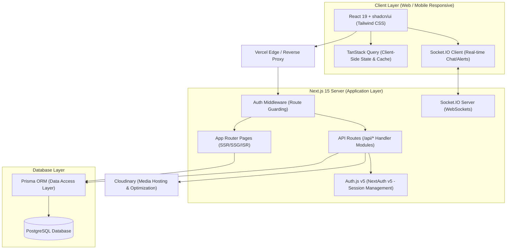

# High-Level Design (HLD) — Campus Connect

Campus Connect is a full-stack, production-ready networking and collaboration platform designed exclusively for college campuses. It serves as a local, private LinkedIn, allowing students, club coordinators, alumni, faculty, and admins to interact, share projects, form hackathon/startup teams, apply for campus opportunities, and message each other in real-time.

---

## 1. System Architecture

Campus Connect is built using a modern, unified JavaScript/TypeScript stack powered by **Next.js 15 (App Router)** and **React 19**. It utilizes a hybrid rendering strategy combining Server-Side Rendering (SSR), Static Site Generation (SSG), and client-side dynamic hydration with **TanStack Query (React Query)**.



---

## 2. Key Modules & Sub-systems

### 2.1. Authentication & Session Management (`Auth.js v5`)
- **Flow**: Supports password-based login (credentials provider) and Google OAuth provider.
- **Session Strategy**: Uses JWT-based session tokens stored in secure, HTTP-only cookies.
- **Role-Based Access Control (RBAC)**: Enforces access restrictions on routes and endpoints based on user roles (`STUDENT`, `CLUB_COORDINATOR`, `FACULTY`, `ALUMNI`, `ADMIN`).
- **Email Verification**: Handles email verification tokens to restrict access to authenticated college email domains (e.g., `@college.edu`).

### 2.2. Professional Profiles & Resume Subsystem
- **Profile Data**: Captures education, experience, achievements, certifications, skills, and coding platform profiles (LeetCode, GitHub, LeetCode/Codeforces slugs).
- **Gamification**: Includes a profile completion index tracker and daily streaks computation based on active days (`streakDays`, `lastActiveAt`).
- **Profile Discovery**: Organizes profiles by department and graduation year. Supports "Open to Work", "Open to Team", and "Looking for Internship" filters.

### 2.3. Networking & Social Graph
- **Bidirectional Connections**: Employs a handshake protocol (`Connection` table) supporting `PENDING`, `ACCEPTED`, and `REJECTED` states.
- **Unidirectional Follows**: Allows students to follow faculty, alumni, or popular students (`Follow` table) to populate their news feed.
- **Mutual Connection Calculation**: Calculates the intersection of accepted connections to show "Mutual Connections" on profile overlays.

### 2.4. Social Feed & Engagement Engine
- **Feed Elements**: Supports text, images, videos, project updates, internships, placements, polls, events, and announcements.
- **Social Graph Filtering**: Feed renders posts based on visibility scopes (`PUBLIC`, `CONNECTIONS`, `CAMPUS`).
- **Engagement Loop**: Enables liking, commenting (nested replies via self-referential parent-child relationships), bookmarking, and resharing posts with personal descriptions.

### 2.5. Project Showcase & Teammate Recruitment
- **Portfolio Showcase**: Allows students to post detailed project outlines with tags, demo links, source code URLs, and technology stack categories.
- **Team Formation Ads**: Project owners create `TeamRecruitment` listings containing the problem statement, team capacity, deadline, workload, and required skills.
- **Application Workflow**: Applicants submit an introduction and resume link. Recruitment leaders review, shortlist, accept, or reject applicants, automatically updating project membership.

### 2.6. Real-Time Chat & Collaboration
- **Websocket Core**: Utilizes Socket.IO built on top of a Next.js custom server to support instant messages.
- **Conversation Threading**: Supports direct chats (1:1), group chats, team channels, and club-wide announcement rooms.
- **Status Syncing**: Delivers indicators for online status, typing states, and read receipts (`lastReadAt`).

### 2.7. Event & Opportunities Hub
- **Opportunities Board**: Faculty and Club Coordinators post internship openings, coding contests, hackathons, and research assistant positions.
- **Clubs & Event Calendars**: Standardized system for organizing student clubs and planning events with attendee caps, RSVP systems, and reminders.

---

## 3. Core System Workflows

### 3.1. Teammate Recruitment & Application Flow
This sequence diagram demonstrates the communication flow between an Applicant, the Next.js API, the PostgreSQL DB via Prisma, and the Project Leader when a student applies for a team opening.

```mermaid
sequenceDiagram
    autonumber
    actor Applicant as Student (Applicant)
    participant Client as Next.js Client
    participant API as Next.js API (/api/teams/[id]/apply)
    database DB as PostgreSQL DB (via Prisma)
    actor Leader as Project Leader

    Applicant->>Client: Clicks "Apply to Team" & submits intro/resume
    Client->>API: POST /api/teams/recruitmentId/apply (Data + Auth Token)
    activate API
    API->>DB: Check if user already applied or is a member
    DB-->>API: No matching records found
    API->>DB: Verify recruitment is active and size has capacity
    DB-->>API: Active, currentMembers < teamSize
    API->>DB: Create TeamApplication (Status: PENDING)
    DB-->>API: Return created TeamApplication
    API->>DB: Create Notification for Leader
    DB-->>API: Notification created
    API-->>Client: 201 Created (Success toast)
    deactivate API
    Client-->>Applicant: Display "Application Pending" status
    
    Note over Leader, DB: Real-time Socket.IO alerts Leader of new application
    Leader->>Client: Views applications panel on dashboard
    Leader->>Client: Clicks "Accept Applicant"
    Client->>API: PATCH /api/applications/appId (Status: ACCEPTED)
    activate API
    API->>DB: Update TeamApplication status to ACCEPTED
    API->>DB: Insert ProjectMember (userId, projectId, role)
    API->>DB: Increment currentMembers count in TeamRecruitment
    API->>DB: Create Notification for Applicant (NotificationType: APPLICATION_ACCEPTED)
    DB-->>API: Transactions complete successfully
    API-->>Client: 200 OK (Status updated)
    deactivate API
    Note over Applicant, DB: Socket.IO notifies Applicant & displays "Joined Team" UI badge
```

---

### 3.2. Real-Time Direct Connection Flow
This workflow describes how two users establish a direct connection, which then affects their feed feed-ranking visibility.

```mermaid
sequenceDiagram
    autonumber
    actor Requester as User A (Requester)
    actor Receiver as User B (Receiver)
    participant API as Next.js API (/api/connections)
    database DB as PostgreSQL DB

    Requester->>API: POST /api/connections { receiverId: UserB_ID }
    activate API
    API->>DB: Insert Connection (requesterId: A, receiverId: B, status: PENDING)
    API->>DB: Create Notification (type: CONNECTION_REQUEST)
    DB-->>API: Saved
    API-->>Requester: 201 Created
    deactivate API
    Note over Receiver: Receives socket alert or views network dashboard
    Receiver->>API: PATCH /api/connections/connId { status: ACCEPTED }
    activate API
    API->>DB: Update Connection status to ACCEPTED
    API->>DB: Insert Connection (requesterId: B, receiverId: A, status: ACCEPTED) (Optional logic or dual-lookup)
    API->>DB: Create Notification (type: CONNECTION_ACCEPTED)
    DB-->>API: Saved
    API-->>Receiver: 200 OK
    deactivate API
```

---

## 4. Key Architectural Decisions

### 4.1. Next.js App Router (Next.js 15)
- **Rationale**: Leverage server components (RSC) to render heavy layouts (like dashboard templates, project outlines, and public profiles) server-side, reducing client-side bundle size. API routes handle client-side operations executed via React 19 forms and TanStack Query.

### 4.2. Relational Schema over Document Schema (PostgreSQL vs MongoDB)
- **Rationale**: Networking platforms are fundamentally relational. The platform relies heavily on foreign keys, cascading deletions, self-referential links (follows, connections, replies), and complex joins (e.g., retrieving posts written by user connections). PostgreSQL handles these transactions cleanly, and Prisma enforces type safety.

### 4.3. NextAuth.js (Auth.js v5)
- **Rationale**: Standardizes authentication flow, easily manages token refreshes, secures API routes using middleware, and securely integrates OAuth (Google) accounts.

### 4.4. State Management Strategy (TanStack Query)
- **Rationale**: Prevents global state management bloat (e.g. Redux). Renders feed lists with client-side cache keys, handles optimistic updates (like immediate like/bookmark toggles before database resolution), and handles cursor-based infinite scroll effortlessly.

---

## 5. Non-Functional Requirements & Security

- **Data Integrity**: Enforces transactional safety using Prisma transactions (`$transaction`) when editing complex states, such as adding a user to a team while incrementing member counts.
- **Soft Deletes**: Key models (`User`, `Post`, `Project`, `Opportunity`, `Club`, `Message`) include a nullable `deletedAt` field to allow recovery and audit compliance rather than executing hard deletions.
- **Input Validation**: Uses **Zod** schema validations on the client and server. No data touches the database without passing parsing layers.
- **Media Optimization**: Images/videos uploaded via Cloudinary are optimized, compressed, and cropped on-the-fly via Cloudinary URLs, preventing high bandwidth consumption.
- **Security Protocols**: Safe path routing using Next.js Middleware, HTTP-Only Cookie storage for sessions, and CORS guards for websocket connections.
